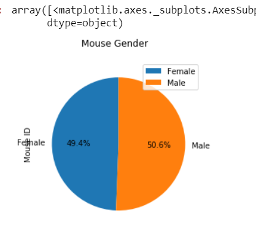
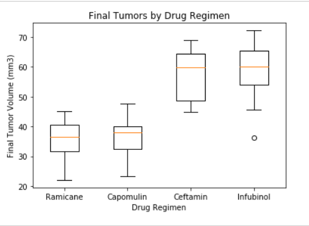

# matplotlib_homework

<h2>Use pandas and matplotlib to analyze cancer research data into charts</h2>
While your data companions rushed off to jobs in finance and government, you remained adamant that science was the way for you. Staying 
true to your mission, you've joined Pymaceuticals Inc., a burgeoning pharmaceutical company based out of San Diego. Pymaceuticals 
specializes in anti-cancer pharmaceuticals. In its most recent efforts, it began screening for potential treatments for squamous cell 
carcinoma (SCC), a commonly occurring form of skin cancer.

As a senior data analyst at the company, you've been given access to the complete data from their most recent animal study. In this 
study, 250 mice identified with SCC tumor growth were treated through a variety of drug regimens. Over the course of 45 days, tumor 
development was observed and measured. The purpose of this study was to compare the performance of Pymaceuticals' drug of interest, 
Capomulin, versus the other treatment regimens. You have been tasked by the executive team to generate all of the tables and figures 
needed for the technical report of the study. The executive team also has asked for a top-level summary of the study results.

For a few comparisons, we also wanted to show differences between using Pandas and using the Matplotlib library.

Drug points bar chart using Pandas:

Drug points bar chart using Matplotlib:

Gender comparison in the study using Pandas:

Gender comparison in the study using Matploylib:

The other charts were helpful in determining the efficacy of the studied drugs using the matplotlib library. These were not re-creacted in pandas.

The following box plot shows the existance of outliers within the study:

This time study shows a comparison in one mouse's tumor size over time:

This last chart shows linear correlation data for another drug studied, along with statistical analysis:

